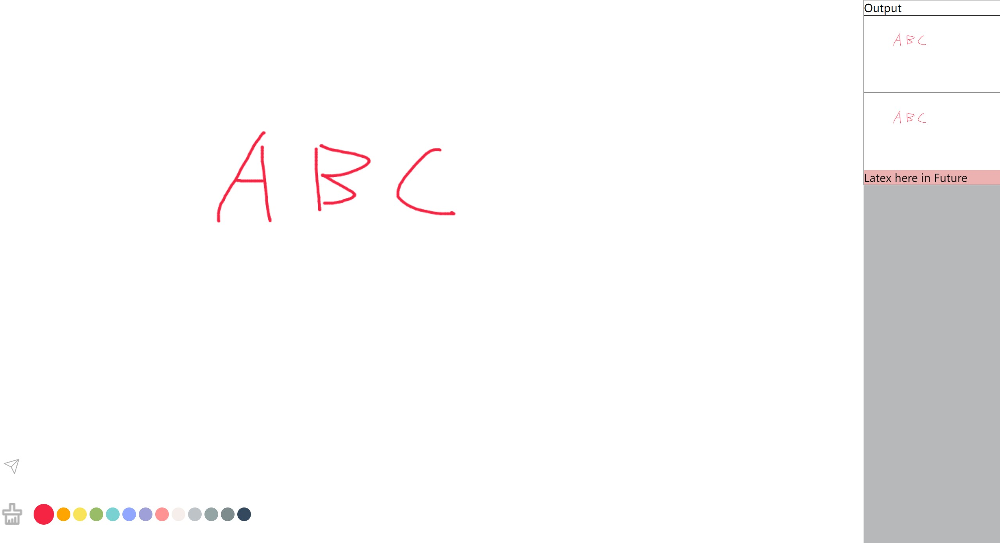

# 同步画板



## 功能
最初计划想实现一个多端手写公式识别器(ipad写公式,电脑复制),然后发现mathpix API用不了,结果就变成了一个手写画板.在ipad上画草图,然后一键发送到其他端打开的网页上面.电脑和ipad协作,或者小组讨论.

可以配合 [SimpleTex](https://simpletex.cn/)使用,在线编辑非常有用.手写的精确度以及识别的精确度不是很好,在线编辑变得非常重要,最初的设计思想不太合适.整个项目更适合作为一个前端开发的练习project.

## 设计思路
后端框架选择了FastApi (不是个好选择),网站通过roomID向服务器注册自己,并建立websocket链接,服务器通过websocket向打开的网页推送数据.

同步没有历史记录,好处数据库都省略了.

最大化兼容性,完全选择了WEB端.一个好后端变得非常重要,FASTAPI过于简陋.

## 部署
安装FastAPI 框架
在局域网里运行如下即可部署,确保防火墙对相应端口开放出战
```
    uvicorn main:app --ws-ping-timeout=300 --host '0.0.0.0' --port 8848
```

## REF
画图板部分来自一下工作
https://github.com/chenyulian/canvas-painter